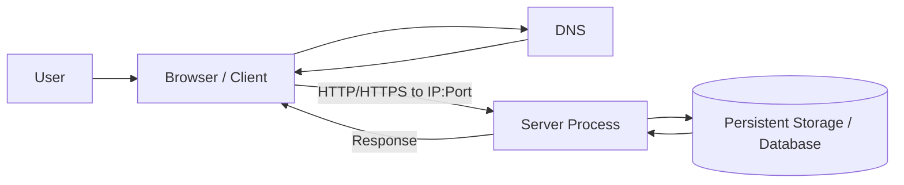

# Computing Fundamentals — Client, Server, Process, CPU, Memory, Storage

## Client and server

A **client** starts a request. A **server** waits for requests, performs work, and returns a response.

```text
Client
   |
   | request
   v
Server
   |
   | response
   v
Client
```

A server is not necessarily a special machine. In software discussions, “server” often means a running program that listens for requests.

## Program vs process

A **program** is code stored somewhere. A **process** is a running instance of that program.

```text
main.py
   |
   | python main.py
   v
Running Python process
```

Each process uses resources such as CPU, memory, files, and networking.

## CPU

The CPU performs computation: executing code, parsing JSON, compressing data, and running calculations.

```text
CPU = computation
```

## Memory / RAM

RAM is the fast, temporary working space used by running processes. If the process disappears, you should assume its RAM contents disappear too.

```text
RAM = temporary working state
```

## Persistent storage

Persistent storage is where data survives process restarts.

```text
CPU  = computation
RAM  = temporary working space
Persistent storage = survives restart
```

This distinction explains why stateless services such as Cloud Run place durable data in GCS, Firestore, BigQuery, or a database rather than process memory.

## IP address

An IP address identifies a network destination/interface.

```text
Client
   |
   | destination IP
   v
Server interface
```

## Port

A machine can run multiple network services. The **IP** identifies the destination interface; the **port** identifies the service at that destination.

```text
10.0.0.5
├── :22   → SSH
├── :5432 → PostgreSQL
└── :8080 → API
```

So:

```text
IP   = where?
Port = which service there?
```

## HTTP

HTTP defines a request/response protocol used by web clients and servers.

```http
GET /products/123
Host: shop.example.com
```

Keep the layers separate:

```text
IP   → destination machine/interface
Port → destination service
HTTP → request/response conversation
```

## DNS

DNS resolves human-readable names to network addresses.

```text
shop.example.com
        |
        | DNS lookup
        v
34.x.x.x
```

A simplified browser request:

```text
User enters https://shop.example.com
        ↓
DNS resolves the name
        ↓
Browser connects to destination IP:443
        ↓
HTTPS request reaches server
        ↓
Server returns response
```

## Architecture view



## Mental model

```text
Program → code stored somewhere
Process → running instance of a program
CPU → performs computation
RAM → temporary working memory
Persistent storage → survives restart
Client → initiates a request
Server → listens and responds
IP → identifies a network destination
Port → identifies a service at that destination
HTTP → request/response protocol
DNS → translates names to addresses
```

## My own explanation

> TODO: Explain every concept above from memory without looking at the notes.
