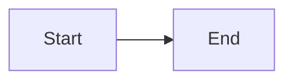

# Topic Name

## What it is

## Why it exists

## Core components

## How it works

## Best-fit scenarios

## When not to use it

## Failure modes

## Security considerations

## Cost considerations

## Mermaid diagram

## My own explanation

> Explain the concept from memory in your own words.

## Questions I still have

- 
